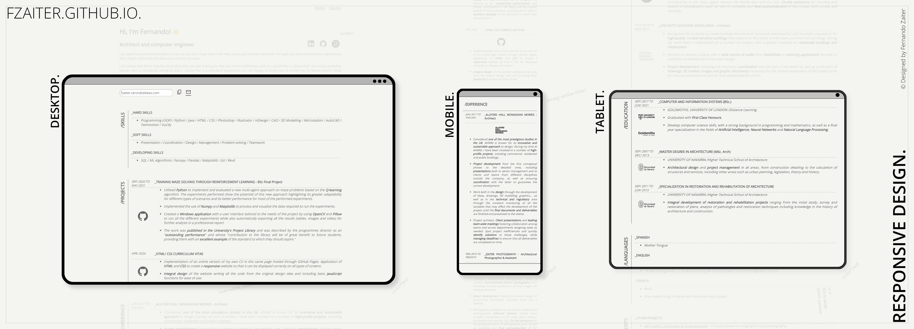

# PERSONAL CURRICULUM VITAE WEB

## A responsive online CV using HTML, CSS, and JavaScript

This project showcases a personal CV in a responsive and custom-designed website built with HTML, CSS, and JavaScript. It reflects my skills and creativity, entirely crafted from scratch. Feel free to use this as a starting point for your own portfolio or CV website.

- **Personalized Style:** Unique design, reflecting my personal brand and highlighting the information through a creative and engaging approach.
- **Interactive Elements:** Utilizes JavaScript for a progress bar, smooth scroll to top, and copy-to-clipboard information to add interactivity, enhancing user engagement and providing an dynamic browsing experience.
- **Easy Github Pages Hosting:** The website is hosted on Github Pages, making it free and simple to implement.
- **Fully Responsive Design:** The layout adjusts to fit various screen sizes, ensuring a seamless experience on desktops, tablets, and mobile devices.
- **Sticky Section Titles:** Sticky titles keep the user informed about the section they're in, even on smaller screens.
- **Language Selection:** A header offers users a choice of language versions.
- **CV Download:** A single click opens the printable CV in a new tab.
- **Accessible Contact Information:** The website features a dedicated section for contact information, making it easy for potential employers or collaborators to reach out.

Responsive Design demonstrating the website's adaptability across various screen sizes and devices

## Tweak this project for your own needs

To adapt this project for your own CV, you can modify the information contained in the HTML files. Each section is contained within a separate section element, which you can expand while keeping the rest collapsed. The main elements to modify are dates, titles, and descriptions.

Additionally, don't forget to update the icons to match your information and remember to update the links they point to.

## Report a bug or suggest an improvement

If you encounter an issue or have an idea for improving this project, please submit an issue using the issues tab above. This will help me address the problem and make the project better for everyone.

## Lessons learned

1. Plan and outline the content: Before starting to design and develop my website, I took the time to plan and outline the content and structure. This helped me to organize my thoughts, prioritize my ideas, and create a clear and concise website.
2. Keep it simple and intuitive: I aimed to create a website that was easy to navigate and understand. I used a simple structure and intuitive layouts to achieve this goal.
3. Use responsive design: To ensure the website looked great on all devices, I used responsive design techniques. This allowed me to create a website that adapts to different screen sizes and devices, without sacrificing the user experience.
4. Test and iterate: To ensure that my website was of high quality I tested it thoroughly and made adjustments as needed. This included testing on different devices and browsers, and seeking feedback from others.
5. Use open-source resources: To save time and improve the quality of my website, I used open-source resources such as Google Fonts and Material Icons. These resources provided a solid foundation for my website, and allowed me to focus on the unique features and content.
6. Learn from others: To improve my skills and knowledge, I learned from other developers and designers. This included studying their code, reading their blogs and articles, and participating in online communities.
